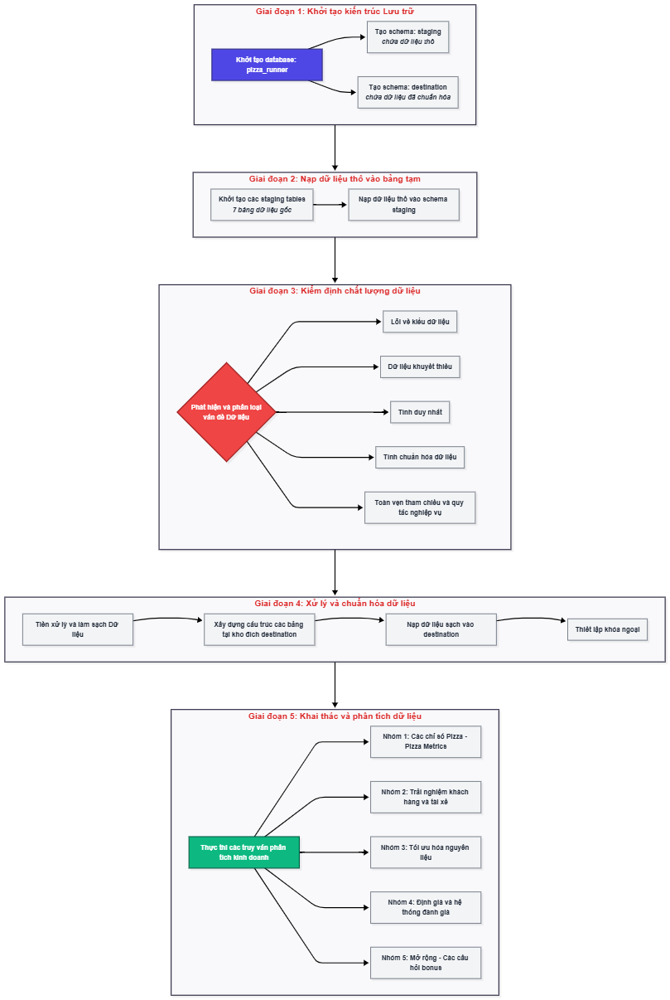
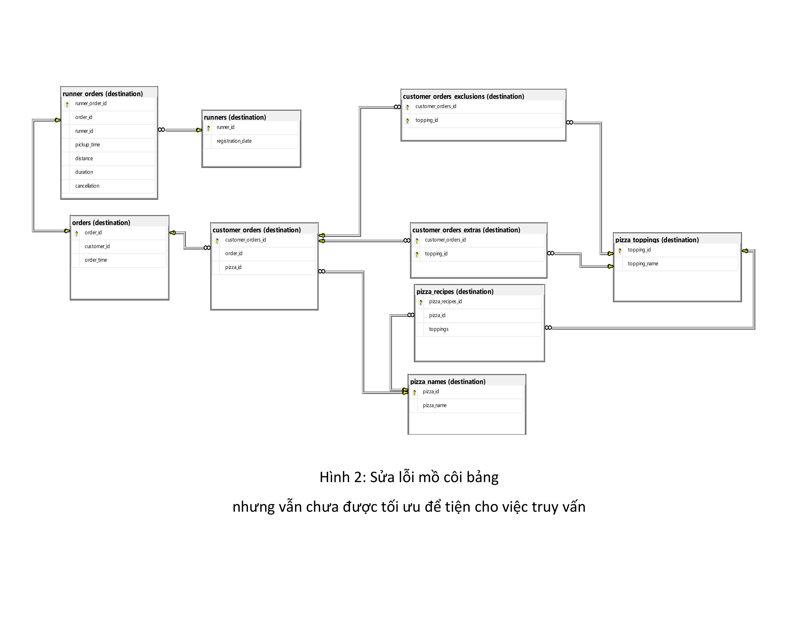

# PIZZA RUNNER DATA ANALYSIS – SQL END-TO-END PROJECT

##  Cấu trúc dự án

```text
week02_pizza_runner/
├── Docs/                                        # Tài liệu và sơ đồ thiết kế hệ thống
│   ├── pizza_runner_workflow.png                # Sơ đồ luồng vận hành của hệ thống
│   ├── 01_erd_loi_mo_coi.png                    # ERD ban đầu (Phát hiện lỗi quan hệ mồ côi)
│   ├── 02_erd_sua_rang_buoc.png                 # ERD giai đoạn 2 (Sửa đổi các ràng buộc PK/FK)
│   └── 03_erd_cau_truc_bonus.png                # ERD hoàn thiện cuối cùng (Hỗ trợ mở rộng Menu)
│
├── Preprocessing_modeling/                      # Xử lý và chuẩn hóa dữ liệu
|   |
│   ├── WEEK02_DataPreprocessing.ipynb           # Làm sạch, chuẩn hóa dữ liệu thô (3NF)
│   └── Modification.ipynb                       # Chỉnh sửa ràng buộc khóa ngoại 
|   |
│   ├── script_sql/                              # Mã nguồn SQL 
│   │   ├── WEEK02_DataPreprocessing.sql          
│   │   └── Modification.sql                      
│
├── Results/                                     # Kết quả phân tích & Business Insights
│   ├── 00_Business_Context                      # Bối cảnh kinh doanh và kiến trúc phân tích
|   |
│   ├── 01_Pizza_Metrics_Results.ipynb           # Phần A: Các chỉ số Pizza
│   ├── 02_Runner_and_Customer_Experience.ipynb  # Phần B: Hiệu suất tài xế & Trải nghiệm khách hàng
│   ├── 03_Ingredient_Optimisation_Results.ipynb # Phần C: Tối ưu hóa nguyên liệu (Toppings)
│   ├── 04_Pricing_and_Ratings_Results.ipynb     # Phần D: Định giá, doanh thu & Lợi nhuận ròng
|   |
│   ├── script_sql/                              # Mã nguồn SQL  
│   │   ├── 01_pizza_metrics.sql                  
│   │   ├── 02_runner_experience.sql              
│   │   ├── 03_ingredient_optimisation.sql        
│   │   ├── 04_pricing_ratings.sql                
│   │   └── 05_bonus_questions.sql                
│
└── README.md                                    # Tổng quan dự án và báo cáo kết quả
```

## 1. TỔNG QUAN DỰ ÁN
**Mô tả**

<p align="center">
  
</p>


Dự án này mô phỏng một hệ thống quản lý đơn hàng pizza cho một startup giao đồ ăn.  
Tôi đã thực hiện **toàn bộ quy trình** từ:
- Làm sạch dữ liệu thô (raw data) từ nguồn https://8weeksqlchallenge.com/case-study-2/ có lỗi nhập liệu.
- Thiết kế schema chuẩn hóa (3NF) với các ràng buộc khóa ngoại.
- Phân tích nghiệp vụ (business metrics) bằng SQL nâng cao.
- Tối ưu hóa vận hành (tạo view, stored procedure).

**Mục tiêu kinh doanh (Business Questions answered):**

- Tối ưu hóa quy trình giao hàng: tìm ra runner nhanh nhất, tỷ lệ giao thành công.
- Phân tích nguyên liệu: topping nào được thêm nhiều nhất, bỏ nhiều nhất.
- Tính lợi nhuận ròng sau khi trừ chi phí vận chuyển.
- Mở rộng menu một cách linh hoạt (Stored Procedure tự động thêm pizza mới).

## 2. CÔNG NGHỆ SỬ DỤNG 
- **Database:** Microsoft SQL Server
- **Tools:** SQL Server Management Studio (SSMS), Git, GitHub
- **Concepts:** Data Cleaning, Normalization, Window Functions, CTE, Views, Stored Procedures, Dynamic SQL.

## 3. LÀM SẠCH VÀ BIẾN ĐỔI DỮ LIỆU 
**Vấn đề dữ liệu thô (Raw Data Issues):**
- Cột `exclusions` / `extras` lưu dạng `'null'`, `'NaN'`, `''` (chuỗi rỗng).
- Cột `distance` có đơn vị `'km'`, `'km '` (có khoảng trắng), hoặc `'null'`.
- Dữ liệu trùng lặp trong `customer_orders` (cùng order_id, pizza_id giống hệt).

**Giải pháp tôi thực hiện:**
- Chuẩn hóa `NULL` (dùng `CASE WHEN ... THEN NULL ELSE ... END`).
- Tách cột đa trị (normalize) bằng `STRING_SPLIT`.
- Tạo `surrogate key` (IDENTITY) để xử lý duplicate.
- Trích xuất số từ chuỗi (`REPLACE` + `CAST`).

*Xem chi tiết trong file `sql_scripts/01_data_preprocessing.sql`*

## 4. MÔ HÌNH DỮ LIỆU (SCHEMA SAU KHI LÀM SẠCH)

<p align="center">
  
</p>

**Nhóm danh mục:**

  * runners (runner_id, registration_date): danh sách tài xế
  * pizza_names (pizza_id, pizza_name): tên các loại pizza
  * pizza_toppings (topping_id, topping_name): danh sách topping (nguyên liệu)
    
**Nhóm công thức:**
  * pizza_recipes (pizza_recipes_id, pizza_id, toppings): bảng nối pizza_id với topping_id, dùng để xác định topping mặc định của mỗi loại pizza.
    
**Nhóm giao dịch (đơn hàng):**
  * orders (order_id, customer_id, order_time): thông tin chốt đơn
  * customer_orders (customer_orders_id, order_id, pizza_id): từng chiếc pizza trong đơn
  * customer_orders_exclusions (customer_orders_id, topping_id): topping khách yêu cầu bỏ
  * customer_orders_extras (customer_orders_id, topping_id): topping khách yêu cầu thêm
    
**Nhóm vận hành:**
  * runner_orders (runner_order_id, order_id, runner_id, pickup_time, distance, duration, cancellation): thông tin về giao nhận 
Tất cả các bảng đã được chuẩn hóa, có khóa chính và khóa ngoại đầy đủ, sẵn sàng cho phân tích.


## 5. NHỮNG INSIGHTS NỔI BẬT 
### A. CÁC CHỈ SỐ PIZZA
- Tổng số pizza được đặt: **14** (kể cả đơn bị hủy).
- Số lượng đơn hàng duy nhất: **10**.
- Pizza được giao nhiều nhất: **Meat Lovers** (9 cái).
- Tỷ lệ giao hàng thành công của runner:
  - Runner 1: 100% (4/4)
  - Runner 2: 75% (3/4)
  - Runner 3: 50% (1/2)

### B. HIỆU SUẤT TÀI XẾ
- **Vận tốc trung bình nhanh nhất:** Runner 1 (≈ 37 km/h trên đơn 10km).
- **Thời gian chuẩn bị đơn hàng** (order → pickup):
  - Đơn 1 bánh: trung bình 10 phút.
  - Đơn 3 bánh: trung bình 23 phút (→ có tương quan tuyến tính).

### C. TỐI ƯU NGUYÊN LIỆU
- **Extras phổ biến nhất:** Bacon (xuất hiện 4 lần).
- **Exclusion phổ biến nhất:** Cheese (bị bỏ 3 lần).
- Tổng lượng nguyên liệu sử dụng cho đơn đã giao:
  - Cheese (xuất hiện 12 lần), Mushrooms (10 lần), Bacon (9 lần)...

### D. ĐỊNH GIÁ VÀ LỢI NHUẬN 
- **Tổng doanh thu (không phí ship):** $152
- **Tổng chi phí trả cho runner ($0.3/km):** $43.86
- **Lợi nhuận ròng của Danny:** $108.14

## 6. TÍNH NĂNG SQL NÂNG CAO
### 1. STORED PROCEDURE THÊM PIZZA MỚI 
CREATE  PROCEDURE destination.sp_AddCustomPizza 
*Xem chi tiết trong file `sql_scripts/Bonus_Questions_Results`*

